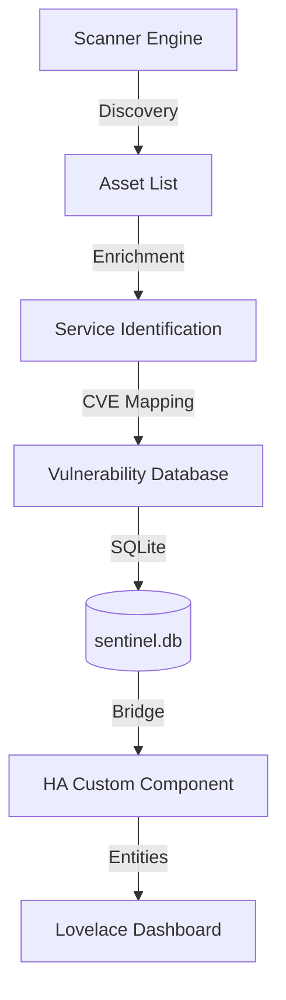

# Project Sentinel

**Project Sentinel** is a Home Network Governance & Risk Management platform designed for Home Assistant. It provides proactive Third-Party Risk Management (TPRM) and Asset Lifecycle Management by identifying devices, scanning for services, and mapping them to known vulnerabilities (CVEs) via the NVD API.

## 🚀 Features

- **Network Discovery**: Automatic mapping of local hosts and MAC addresses.
- **Service Enrichment**: Banner grabbing to identify running software versions.
- **Vulnerability Mapping**: Integration with the NVD (National Vulnerability Database) API to find active CVEs.
- **Home Assistant Integration**: 
  - **Add-on**: Background engine that handles scanning and maintains a persistent SQLite database.
  - **Custom Component**: Exposes network health, device counts, and critical vulnerabilities as Home Assistant entities.
- **Modern Dashboard**: Lovelace-ready visualizations for your network's security posture.

## 🏗️ Architecture

## 📂 Project Structure

- `/sentinel`: The core Python engine for scanning and NVD integration.
- `/addon`: Configuration files for the Home Assistant Add-on.
- `/custom_components`: The HACS-ready Home Assistant integration.
- `/lovelace`: Sample dashboard YAML configuration.
- `/poc`: Early Proof of Concept scripts.

## 🛠️ Installation (In Development)

> [!WARNING]
> Project Sentinel is currently in **Active Development (Phase 5)**. Manual installation is required.

### 1. Requirements
- Python 3.11+
- Network access for discovery (arp-scan/nmap recommended in future modules).
- NVD API Key (optional but recommended for rate limiting).

### 2. Add-on Setup
1. Copy the `addon/` folder to your local Home Assistant Add-ons repository.
2. Build and Start the Add-on from the HA Supervisor.

### 3. Integration Setup
1. Copy `custom_components/project_sentinel` to your HA `config/custom_components`.
2. Add `project_sentinel:` to your `configuration.yaml`.
3. Restart Home Assistant.

## 📜 Roadmap

- [ ] UI-based Config Flow (Settings page).
- [ ] Improved CPE matching for more accurate vulnerability detection.
- [ ] Actionable notifications for newly discovered critical CVEs.
- [ ] Device history and tracking.

## ☕ Support the Project

If you find Project Sentinel useful and would like to support its development, tips are greatly appreciated!

[**Tip via PayPal**](https://paypal.me/jgrippe1)

## 🤝 Contributing

Contributions are welcome! Please feel free to submit a Pull Request or open an issue in the [project_sentinel_dev](https://github.com/jgrippe1/project_sentinel_dev) repository.

---
*Disclaimer: Project Sentinel is intended for home security auditing and governance. Use responsibly on your own network.*
