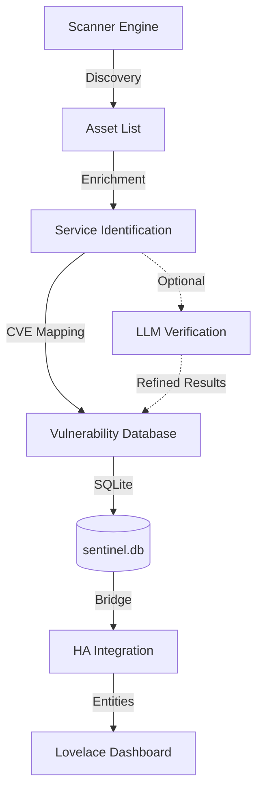

# Project Sentinel

**Project Sentinel** is a Home Network Governance & Risk Management platform designed for Home Assistant. It provides proactive Asset Lifecycle Management by identifying devices, scanning for services, and mapping them to known vulnerabilities (CVEs) via the NVD API.

## 🚀 Features

- **Network Discovery**: Automatic mapping of local hosts and services using `nmap`.
- **Service Enrichment**: Robust regex-based banner grabbing to identify software versions (e.g., `Dropbear sshd 2018.76`).
- **Vulnerability Mapping**: Real-time integration with the NVD (National Vulnerability Database) API.
- **Hybrid Analysis Engine**: Combines local regex heuristics with an optional LLM (OpenAI, Google Gemini, Anthropic, Ollama) to reduce false positives.
- **Home Assistant Integration**: 
  - **Add-on**: Background engine that handles scanning and maintains a persistent SQLite database.
  - **Integration**: Exposes network health, device counts, and critical vulnerabilities as Home Assistant entities.
- **Modern Dashboard**: UI-based configuration and Lovelace-ready visualizations.

## 🏗️ Architecture

## 🧩 Add-on vs Integration

Project Sentinel consists of two parts that work together:

### 1. The Add-on ("The Brain")
*   **Role**: Core Logic & Scanning.
*   **Function**: Runs as a background container. It executes `nmap` scans, querys the NVD API, performs regex/LLM analysis, and writes to the database.
*   **Requirement**: **Required**. Without this, no data is collected.

### 2. The HACS Integration ("The Viewer")
*   **Role**: Visualization & Sensors.
*   **Function**: Connects Home Assistant to the Add-on's shared database. It creates entities (e.g., `sensor.sentinel_active_devices`) and powers the dashboard.
*   **Requirement**: **Required** for Home Assistant visibility.

## 📂 Project Structure

- `/project_sentinel`: The Home Assistant Add-on source and configuration.
- `/custom_components`: The HACS-ready Home Assistant integration.
- `/lovelace`: Sample dashboard YAML configuration.

## 🛠️ Installation

### 1. Install the Add-on
1. In Home Assistant, go to **Settings > Add-ons > Add-on Store**.
2. Click the **three dots > Repositories**.
3. Add `https://github.com/jgrippe1/project_sentinel_dev`.
4. Search for and install **Project Sentinel**.
5. Configure your `subnets` (e.g., `192.168.1.0/24`) in the configuration tab and **Start**.

### 2. Install the Integration (via HACS)
1. In Home Assistant, navigate to **HACS**.
2. Click the **three dots > Custom repositories**.
3. Add `https://github.com/jgrippe1/project_sentinel_dev` with **Category: Integration**.
4. Install **Project Sentinel** and **Restart Home Assistant**.

### 3. Setup Integration
1. Go to **Settings > Devices & Services > Add Integration**.
2. Search for **Project Sentinel**.
3. Point to the shared database: `/share/sentinel.db`.

## 📡 Router Integration (Optional)

**This feature is completely optional.**

By default, Project Sentinel performs active network scanning (ping/ARPs) to find online devices.
However, you can optionally configure SSH access to your router (e.g., Asuswrt-Merlin) to unlock "Router Enhanced" mode.

**Benefits of Router Integration:**
*   **Offline Devices**: Detects devices that are currently asleep but have a valid lease.
*   **Better Metdata**: Imports custom names (e.g., "Dad's Phone") and device types directly from the router.
*   **Connection Type**: Distinguishes between Wired vs Wireless connections.

*If not configured, the add-on will still function fully as a vulnerability scanner for all currently active devices.*

## 🤖 Hybrid CVE Verification (Optional)

**This feature is completely optional.**

By default, Sentinel uses a high-performance local regex engine to match software versions against CVEs. 

You can optionally enable an LLM (Large Language Model) to act as a "second opinion" for complex cases where regex is inconclusive (<80% confidence). This can significantly reduce false positives by allowing an AI to "read" the CVE description and determine if it applies to your specific hardware.

Supported Providers:
- **OpenAI** (GPT-3.5/4)
- **Google** (Gemini 1.5 Flash/Pro) - *Recommended for low cost*
- **Anthropic** (Claude 3)
- **Ollama** (Local Llama3, Mistral) - *Recommended for privacy*

See [USER_GUIDE.md](USER_GUIDE.md) for detailed configuration instructions.

## ☕ Support the Project

If you find Project Sentinel useful, tips are greatly appreciated!

[**Tip via PayPal**](https://paypal.me/jgrippe1)

## 🤝 Contributing

Contributions are welcome! Please feel free to submit a Pull Request or open an issue.

---
*Disclaimer: Project Sentinel is intended for home security auditing. Use responsibly on your own network.*
