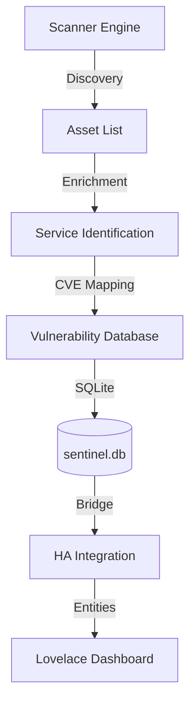

# Project Sentinel

**Project Sentinel** is a Home Network Governance & Risk Management platform designed for Home Assistant. It provides proactive Third-Party Risk Management (TPRM) and Asset Lifecycle Management by identifying devices, scanning for services, and mapping them to known vulnerabilities (CVEs) via the NVD API.

## 🚀 Features

- **Network Discovery**: Automatic mapping of local hosts and services.
- **Service Enrichment**: Robust regex-based banner grabbing to identify software versions.
- **Vulnerability Mapping**: Real-time integration with the NVD (National Vulnerability Database) API.
- **Home Assistant Integration**: 
  - **Add-on**: Background engine that handles scanning and maintains a persistent SQLite database.
  - **Integration**: Exposes network health, device counts, and critical vulnerabilities as Home Assistant entities.
- **Modern Dashboard**: UI-based configuration and Lovelace-ready visualizations.

## 🏗️ Architecture

## 📂 Project Structure

- `/project_sentinel`: The Home Assistant Add-on source and configuration.
- `/custom_components`: The HACS-ready Home Assistant integration.
- `/lovelace`: Sample dashboard YAML configuration.

## 🛠️ Installation

### 1. Install the Add-on
1. In Home Assistant, go to **Settings > Add-ons > Add-on Store**.
2. Click the **three dots > Repositories**.
3. Add `https://github.com/jgrippe1/project_sentinel_dev`.
4. Search for and install **Project Sentinel**.
5. Configure your `subnets` (e.g., `192.168.1.0/24`) in the configuration tab and **Start**.

### 2. Install the Integration (via HACS)
1. In Home Assistant, navigate to **HACS**.
2. Click the **three dots > Custom repositories**.
3. Add `https://github.com/jgrippe1/project_sentinel_dev` with **Category: Integration**.
4. Install **Project Sentinel** and **Restart Home Assistant**.

### 3. Setup Integration
1. Go to **Settings > Devices & Services > Add Integration**.
2. Search for **Project Sentinel**.
3. Point to the shared database: `/share/sentinel.db`.

## 📜 Roadmap

- [x] UI-based Config Flow.
- [x] Real-time NVD API Integration.
- [ ] Actionable notifications for newly discovered critical CVEs.
- [ ] Device history and tracking.

## ☕ Support the Project

If you find Project Sentinel useful, tips are greatly appreciated!

[**Tip via PayPal**](https://paypal.me/jgrippe1)

## 🤝 Contributing

Contributions are welcome! Please feel free to submit a Pull Request or open an issue.

---
*Disclaimer: Project Sentinel is intended for home security auditing. Use responsibly on your own network.*
